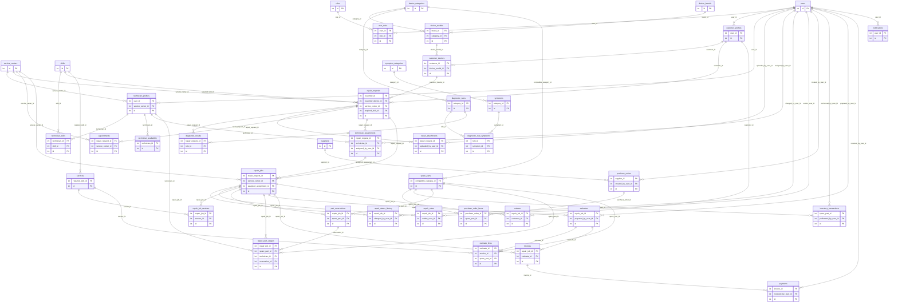

# Database: 40 related domain models

```mermaid
erDiagram
    roles {
        int id PK
    }
    users {
        int id PK
    }
    user_roles {
        int user_id FK
        int role_id FK
        int id PK
    }
    roles ||--o{ user_roles : "role_id"
    users ||--o{ user_roles : "user_id"
    customer_profiles {
        int user_id FK
        int id PK
    }
    users ||--o{ customer_profiles : "user_id"
    technician_profiles {
        int user_id FK
        int service_center_id FK
        int id PK
    }
    users ||--o{ technician_profiles : "user_id"
    service_centers ||--o{ technician_profiles : "service_center_id"
    skills {
        int id PK
    }
    technician_skills {
        int technician_id FK
        int skill_id FK
        int id PK
    }
    technician_profiles ||--o{ technician_skills : "technician_id"
    skills ||--o{ technician_skills : "skill_id"
    service_centers {
        int id PK
    }
    device_categories {
        int id PK
    }
    device_brands {
        int id PK
    }
    device_models {
        int brand_id FK
        int category_id FK
        int id PK
    }
    device_categories ||--o{ device_models : "category_id"
    device_brands ||--o{ device_models : "brand_id"
    customer_devices {
        int customer_id FK
        int device_model_id FK
        int id PK
    }
    customer_profiles ||--o{ customer_devices : "customer_id"
    device_models ||--o{ customer_devices : "device_model_id"
    symptom_categories {
        int id PK
    }
    symptoms {
        int category_id FK
        int id PK
    }
    symptom_categories ||--o{ symptoms : "category_id"
    diagnostic_rules {
        int category_id FK
        int id PK
    }
    device_categories ||--o{ diagnostic_rules : "category_id"
    diagnostic_rule_symptoms {
        int rule_id FK
        int symptom_id FK
        int id PK
    }
    diagnostic_rules ||--o{ diagnostic_rule_symptoms : "rule_id"
    symptoms ||--o{ diagnostic_rule_symptoms : "symptom_id"
    diagnostic_results {
        int repair_request_id FK
        int rule_id FK
        int id PK
    }
    diagnostic_rules ||--o{ diagnostic_results : "rule_id"
    repair_requests ||--o{ diagnostic_results : "repair_request_id"
    repair_requests {
        int customer_id FK
        int customer_device_id FK
        int service_center_id FK
        int required_skill_id FK
        int id PK
    }
    service_centers ||--o{ repair_requests : "service_center_id"
    customer_profiles ||--o{ repair_requests : "customer_id"
    customer_devices ||--o{ repair_requests : "customer_device_id"
    skills ||--o{ repair_requests : "required_skill_id"
    repair_attachments {
        int repair_request_id FK
        int uploaded_by_user_id FK
        int id PK
    }
    repair_requests ||--o{ repair_attachments : "repair_request_id"
    users ||--o{ repair_attachments : "uploaded_by_user_id"
    appointments {
        int repair_request_id FK
        int service_center_id FK
        int id PK
    }
    service_centers ||--o{ appointments : "service_center_id"
    repair_requests ||--o{ appointments : "repair_request_id"
    technician_availability {
        int technician_id FK
        int id PK
    }
    technician_profiles ||--o{ technician_availability : "technician_id"
    technician_assignments {
        int repair_request_id FK
        int technician_id FK
        int assigned_by_user_id FK
        int id PK
    }
    repair_requests ||--o{ technician_assignments : "repair_request_id"
    users ||--o{ technician_assignments : "assigned_by_user_id"
    technician_profiles ||--o{ technician_assignments : "technician_id"
    repair_jobs {
        int repair_request_id FK
        int service_center_id FK
        int assigned_assignment_id FK
        int id PK
    }
    service_centers ||--o{ repair_jobs : "service_center_id"
    repair_requests ||--o{ repair_jobs : "repair_request_id"
    technician_assignments ||--o{ repair_jobs : "assigned_assignment_id"
    repair_status_history {
        int repair_job_id FK
        int changed_by_user_id FK
        int id PK
    }
    users ||--o{ repair_status_history : "changed_by_user_id"
    repair_jobs ||--o{ repair_status_history : "repair_job_id"
    repair_notes {
        int repair_job_id FK
        int author_user_id FK
        int id PK
    }
    repair_jobs ||--o{ repair_notes : "repair_job_id"
    users ||--o{ repair_notes : "author_user_id"
    services {
        int required_skill_id FK
        int id PK
    }
    skills ||--o{ services : "required_skill_id"
    repair_job_services {
        int repair_job_id FK
        int service_id FK
        int id PK
    }
    repair_jobs ||--o{ repair_job_services : "repair_job_id"
    services ||--o{ repair_job_services : "service_id"
    suppliers {
        int id PK
    }
    spare_parts {
        int compatible_category_id FK
        int id PK
    }
    device_categories ||--o{ spare_parts : "compatible_category_id"
    purchase_orders {
        int supplier_id FK
        int created_by_user_id FK
        int id PK
    }
    users ||--o{ purchase_orders : "created_by_user_id"
    suppliers ||--o{ purchase_orders : "supplier_id"
    purchase_order_items {
        int purchase_order_id FK
        int spare_part_id FK
        int id PK
    }
    purchase_orders ||--o{ purchase_order_items : "purchase_order_id"
    spare_parts ||--o{ purchase_order_items : "spare_part_id"
    inventory_transactions {
        int spare_part_id FK
        int performed_by_user_id FK
        int id PK
    }
    spare_parts ||--o{ inventory_transactions : "spare_part_id"
    users ||--o{ inventory_transactions : "performed_by_user_id"
    part_reservations {
        int repair_job_id FK
        int spare_part_id FK
        int id PK
    }
    repair_jobs ||--o{ part_reservations : "repair_job_id"
    spare_parts ||--o{ part_reservations : "spare_part_id"
    repair_part_usages {
        int repair_job_id FK
        int spare_part_id FK
        int technician_id FK
        int reservation_id FK
        int id PK
    }
    spare_parts ||--o{ repair_part_usages : "spare_part_id"
    part_reservations ||--o{ repair_part_usages : "reservation_id"
    technician_profiles ||--o{ repair_part_usages : "technician_id"
    repair_jobs ||--o{ repair_part_usages : "repair_job_id"
    estimates {
        int repair_job_id FK
        int prepared_by_user_id FK
        int id PK
    }
    repair_jobs ||--o{ estimates : "repair_job_id"
    users ||--o{ estimates : "prepared_by_user_id"
    estimate_lines {
        int estimate_id FK
        int service_id FK
        int spare_part_id FK
        int id PK
    }
    services ||--o{ estimate_lines : "service_id"
    spare_parts ||--o{ estimate_lines : "spare_part_id"
    estimates ||--o{ estimate_lines : "estimate_id"
    invoices {
        int repair_job_id FK
        int estimate_id FK
        int id PK
    }
    repair_jobs ||--o{ invoices : "repair_job_id"
    estimates ||--o{ invoices : "estimate_id"
    payments {
        int invoice_id FK
        int received_by_user_id FK
        int id PK
    }
    users ||--o{ payments : "received_by_user_id"
    invoices ||--o{ payments : "invoice_id"
    reviews {
        int repair_job_id FK
        int customer_id FK
        int id PK
    }
    customer_profiles ||--o{ reviews : "customer_id"
    repair_jobs ||--o{ reviews : "repair_job_id"
    notifications {
        int user_id FK
        int id PK
    }
    users ||--o{ notifications : "user_id"
```
